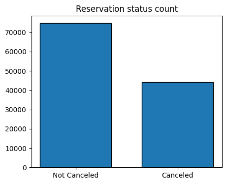
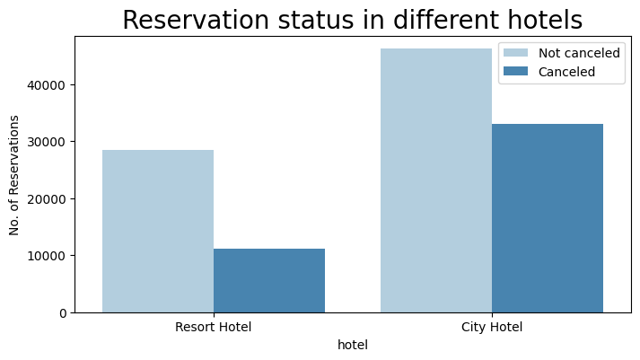
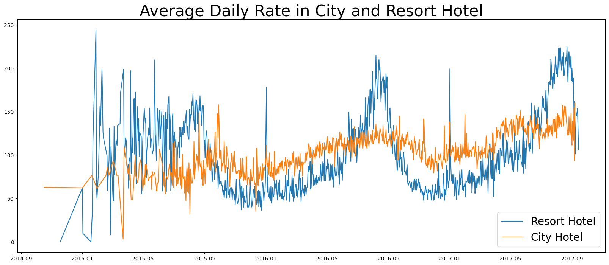
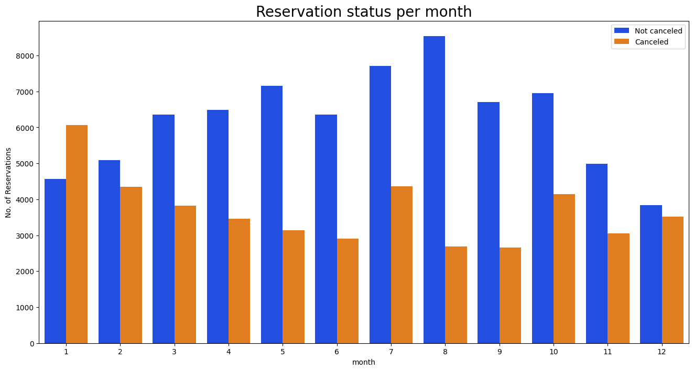
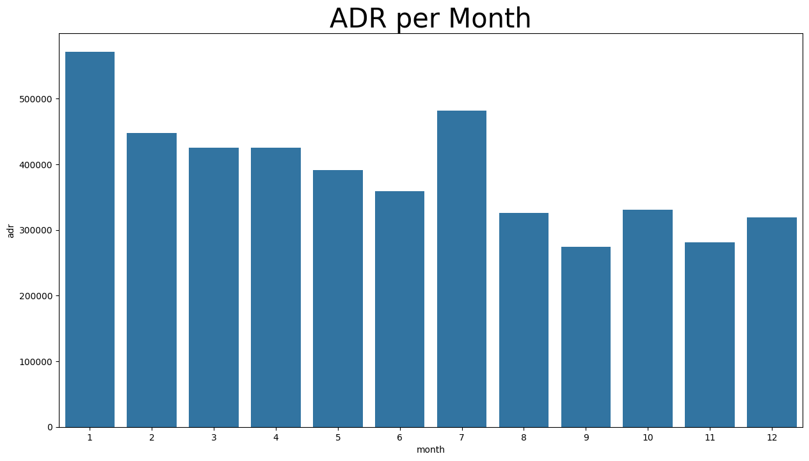
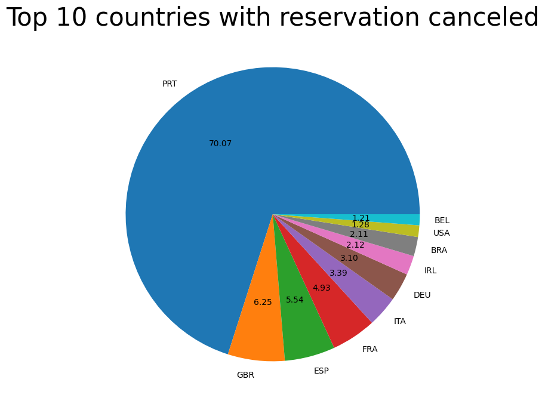
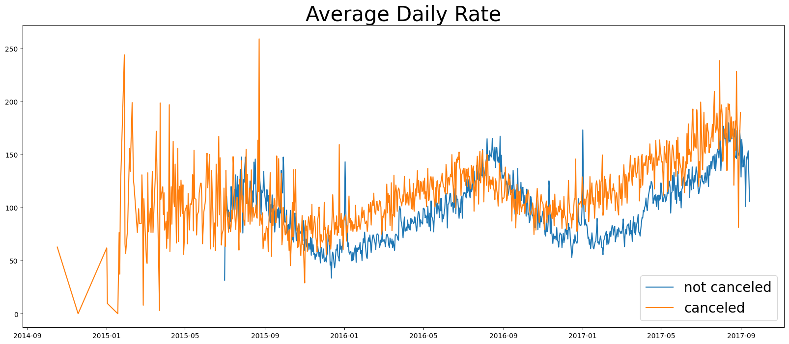
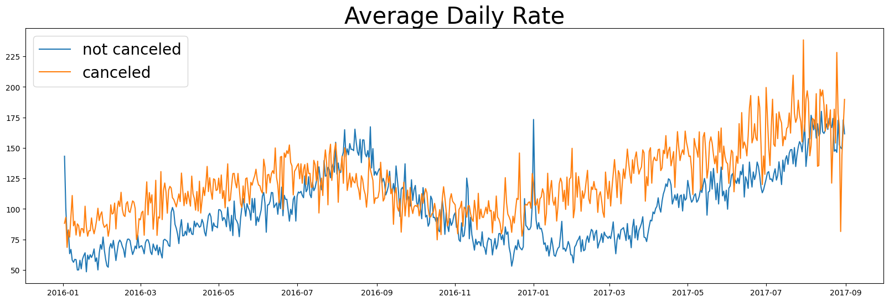

# 📊 Gaurav's Analytics Portfolio

# [Project 1: 🏨 Hotel Booking & Cancellation Analysis]()

This is my first project I did for my Analytics Protfolio, where I build a recommendation system for Hotel Bookings and Cancelations dataset.

## 📌 Project Overview
In recent years,City Hotel and Resort Hotel have seen high cancellation rates. Each hotel is now dealing with a number of issues as a result,including fewer revenues and less than ideal hotel room use.Consequently, lowering cancellation rates is both hotels' primary goal in order to increase their efficiency in generating revenue, and for us to offer thorough business advice to address this problem.
The analysis of hotel booking cancellations as well as other factors that have no bearing on their business and yearly revenue generation are the main topics of this report.

---
## Assumptions
1. No unusual occurences between 2015 and 2017 will have a substantial impact on the data used. 
2. The information is still current and can be used to analyze a hotel's possible plans in an efficient manner.
3. There are no unanticipated negatives to the Hotel employing any advised technique. 
4. The hotels are not currently using any of the suggested solutions. 
5. The biggest factor affecting the effectiveness of earning income is booking cancellations.
6. Cancellations result in vacant rooms for the blocked length of time.
7. Clients make hotel reservations the same year they make cancellations

---

    

## 🎯 Problem Statement
- What are the key factors that lead to hotel booking cancellations?
- How to reduce cancellation rates and promote revenue generation?
- Assistance to hotels in making pricing and marketing decisions?

---

## 📊 Data Identification
**Dataset:** `hotel_bookings.csv`  
**Key Columns Include:**
- Hotel type (`City Hotel`, `Resort Hotel`)
- Lead time
- Booking and arrival dates
- Number of adults, children, babies
- Market segment and distribution channel
- Deposit type and customer type
- Average Daily Rate (ADR)
- Special requests and previous cancellations

---
## Hypothesis

1. Higher prices leads to more cancellations.
2. Customers tend to cancel their booking when there is a longer waiting period for reservation confirmation.
3. The majority of Clients are booking through offline modes which tend to increase the cancellation due to pay on arrival.

## 🧹 Data Exploration & Cleaning
### Steps:
1. **Import and Inspect Data**
   - Check dataset shape, column types, and sample records.
2. **Handle Missing Values**
   - Identify and impute or drop missing data appropriately.
3. **Remove Duplicates & Outliers**
   - Eliminate redundant rows and handle extreme ADR or lead time values.
4. **Feature Formatting**
   - Convert date columns, encode categorical variables, and create derived features if necessary.

---

## 🔍 Data Analysis & Insights
### Exploratory Analysis:
- Booking and cancellation distribution.
- Cancellations by hotel type, month, and lead time.
- Impact of deposit type and market segment.
- Relationship between special requests and cancellations.

### Visualizations:
- Bar plots, pie charts, and histograms.
- Correlation heatmaps.
- Trend lines for booking patterns over time.

---

## 📈 Key Findings

1.The Bar graph shows the reservations that are canceled and those that are not. According to the Analysis performed we found out that approx 37 % of clients canceled their reservations,that is a key factor contributing to decline in hotel earnings ,though, the number of bookings were high enough.

2.This shows in comparison to resort hotels, city hotels have more bookings, indicating that resort hotels have higher prices.

3.The Line graph shows that,on certain days,the average daily rate for a city hotel is less than that of resort hotels and on some days it is less. This indicates that weekends and holidays may see price hikes in resort hotels' rates.

4.We developed the grouped Bar graph to the analyze the months with the highest and the lowest reservation levels according to reservation status. On close observation. we found out that, Highest number of reservations were recorded on non-winter months with comparetively low levels of cancellation with August as an outperformer for the whole year, than winter or cold-months with most level of cancellations in the month of January.This indicates the seasonal effect on Hotel Bookings.

5.This graph shows that extreme price levels lead to higher cancellations and Lower price levels encourage less number of cancellations. Therefore, cost is major factor while analyzing the hotel booking cancellations.

6. Now let us find out, clients of which country are most likely to cancel their bookings.The Top country is the Pie Chart is Portugal with the highest number of cancellations.

7.Lets check the area from where guests are visiting the hotels and making reservations. Is it coming from Direct or Groups, Online or Offline Travel Agents?
Around 46 % Client come from Online Travel Agencies
Whereas 27 % come from Groups
Only 4 % clients directly book hotels by Visiting them and making reservations

8. This Date has many missing informations so we cleaned,optimised and extracted only the consistent Data and created a Line graph which represents data from 2016 till 2017-August.

This is the optimised Line graph we will use for further analysis.

On close observation, we found out reservations are canceled when Average Daily Rate(ADR) is higher than Not canceled ADR,
This Justifies that higher prices lead to higher Cancellations.

---

## 🧠 Conclusion & Recommendations

1.Cancellation rates rise with rise in price levels. To tackle this problem, hotels need to work on the pricing strategies and try to lower the rates on specific days or even give discount benefits to increase customer retention.
2.As the ratio of canceled to not canceled of Resort hotels is higher than City hotels on specific days so it is suggested that hotels should keep reasonable prices on holidays and weekends in order to reduce cancellations which will inturn increase the customer satisfaction.
3.January and winter months should have adequate marketing campaigns with reasonable prices, as the cancellation levels are highest recorded for these months.
4.Hotels in Portugal must increase quality of their services and keep it up-to-date with the taste of people living there by conducting surveys and utilizing feedback from clients. This will increase customer satisfaction and generate higher earnings to the hotels.

---

## 💻 Tools & Libraries
- Python (Pandas, NumPy, Matplotlib, Seaborn)
- Jupyter Notebook
  
---

## ✍️ Author
**Gaurav Gyansu**  
*Data Analytics Portfolio Project*  
📧 [gyansu75@gmail.com] | 🔗 [LinkedIn](www.linkedin.com/in/gaurav-gyansu-66b1121b9)

---

